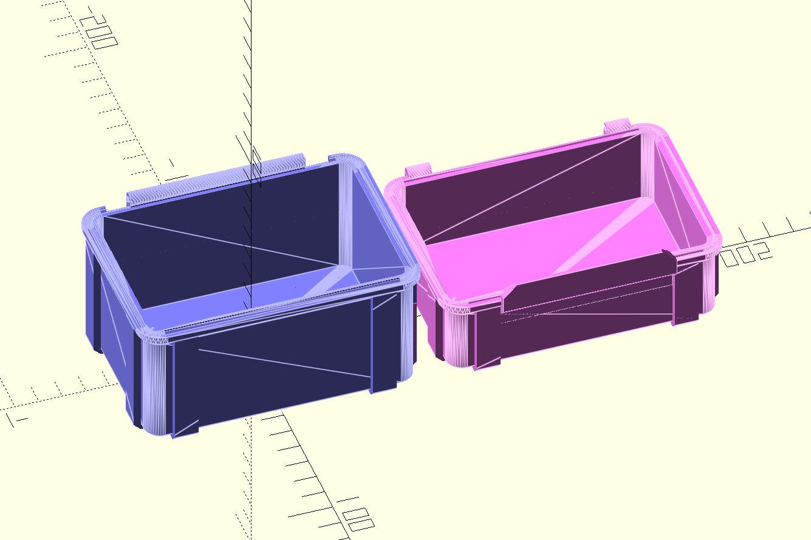
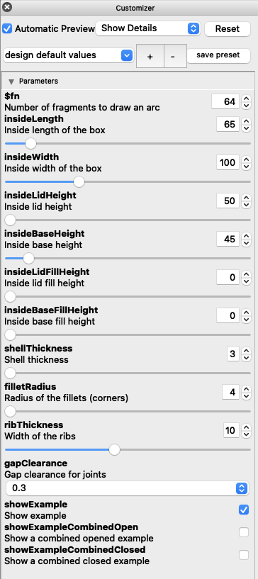

# OpenSCAD Box

Reproduction of [Parametrizable Rugged Box](https://www.printables.com/model/168664-parametrizable-rugged-box-openscad) built in [OpenSCAD](http://www.openscad.org/) that focuses on the size of the inside of the box rather than the size of the outside of the box.

## Box Types

* [Basic Box](#basic-box)
* [Rod Box](#rod-box)
* [Screw Box](#screw-box)
* [Ammo Box](#ammo-box)

## Basic Box

This box does not require anything additional to put it together.

### Usage

Include the file `openscad-box.scad`:

```openscad
include <openscad-box.scad>
```

Use the function `openBox()`. Two boxes need to be created; a top and a bottom

```openscad
// top
openBox(length=65, width=100, height=25, shell=3, fillet=4, rib=10, clearance=0.3, top=true);

// bottom
openBox(length=65, width=100, height=45, shell=3, fillet=4, rib=10, clearance=0.3, top=false);
```

Arguments:

* __length__ Inside length of the box. Best between 50-220
* __width__ Inside width of the box. Best between 50-220
* __height__ Inside height of the box. Best between 50-220
* __fill__ Inside fill height of the box. Between 0 and `height` (default: `0`)
* __shell__ The thickness of the walls (side and bottom). Between 3-9 (default: `3`)
* __fillet__ Radius of the fillets (corners). Between 4-20 (default: `4`)
* __rib__ Rib thickness (width). Between 6-20 (default: `10`)
* __clearance__ Gap clearance for joints. Between 0.1-0.4 (default: `0.3`)
* __top__ Top or bottom box (default: `false`)

### Example

Box with default options:

```openscad
use <openscad-box.scad>
openBox(length=65, width=100, height=25, top=true);
openBox(length=65, width=100, height=45, top=false);
```



### Customizer



## Rod Box

This box requires a 3mm (1/8") diameter rod for the hinge.

### Usage

Include the file `openscad-rod-box.scad`:

```openscad
include <openscad-rod-box.scad>
```

Use the function `openRodBox()`. Two boxes need to be created; a top and a bottom

```openscad
// top
openRodBox(length=65, width=100, height=25, shell=3, fillet=4, rib=10, clearance=0.3, top=true);

// bottom
openRodBox(length=65, width=100, height=45, shell=3, fillet=4, rib=10, clearance=0.3, top=false);
```

Arguments:

* __length__ Inside length of the box. Best between 50-220
* __width__ Inside width of the box. Best between 50-220
* __height__ Inside height of the box. Best between 50-220
* __fill__ Inside fill height of the box. Between 0 and `height` (default: `0`)
* __shell__ The thickness of the walls (side and bottom). Between 3-9 (default: `3`)
* __fillet__ Radius of the fillets (corners). Between 4-20 (default: `4`)
* __rib__ Rib thickness (width). Between 6-20 (default: `10`)
* __clearance__ Gap clearance for joints. Between 0.1-0.4 (default: `0.3`)
* __top__ Top or bottom box (default: `false`)

### Example

Box with default options:

```openscad
use <openscad-rod-box.scad>
openRodBox(length=65, width=100, height=25, top=true);
openRodBox(length=65, width=100, height=45, top=false);
```

## Screw Box

This box requires 2 M3 x 20 screws for the hinges.

### Usage

Include the file `openscad-screw-box.scad`:

```openscad
include <openscad-screw-box.scad>
```

Use the function `openScrewBox()`. Two boxes need to be created; a top and a bottom

```openscad
// top
openScrewBox(length=65, width=100, height=25, shell=3, fillet=4, rib=10, clearance=0.3, top=true);

// bottom
openScrewBox(length=65, width=100, height=45, shell=3, fillet=4, rib=10, clearance=0.3, top=false);
```

Arguments:

* __length__ Inside length of the box. Best between 50-220
* __width__ Inside width of the box. Best between 50-220
* __height__ Inside height of the box. Best between 50-220
* __fill__ Inside fill height of the box. Between 0 and `height` (default: `0`)
* __shell__ The thickness of the walls (side and bottom). Between 3-9 (default: `3`)
* __fillet__ Radius of the fillets (corners). Between 4-20 (default: `4`)
* __rib__ Rib thickness (width). Between 6-20 (default: `10`)
* __screw__ Screw size (default: `3`)
* __hinge__ Hinge diameter (default: `5.68`)
* __snap__ Snap cutout (default: `false`)
* __clearance__ Gap clearance for joints. Between 0.1-0.4 (default: `0.3`)
* __top__ Top or bottom box (default: `false`)

### Example

Box with default options:

```openscad
use <openscad-screw-box.scad>
openScrewBox(length=65, width=100, height=25, top=true);
openScrewBox(length=65, width=100, height=45, top=false);
```

## Ammo Box

TODO

## TODO

1. Minumum lid snap width
2. Maximum lid snap width
3. Customizable text
  * Lid, top, bottom right
  * Base, front, bottom right
  * Base, bottom, top left
  * Base, bottom, middle left
